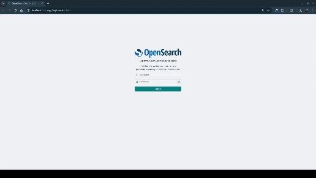

<a name="readme-top"></a>

<!-- PROJECT LOGO -->

<br />
<div align="center">
  <a href="https://github.com/williamelias/opensearch-tutorial">
    <!--  -->
  </a>

<h3 align="center">opensearch-study</h3>

</div>


<!-- TABLE OF CONTENTS -->
<details>
  <summary>Table of Contents</summary>
  <ol>
    <li>
      <a href="#about-the-project">About The Project</a>
      <ul>
        <li><a href="#built-with">Built With</a></li>
      </ul>
    </li>
    <li>
      <a href="#getting-started">Getting Started</a>
      <ul>
        <li><a href="#prerequisites">Prerequisites</a></li>
        <li><a href="#installation">Installation</a></li>
        <li><a href="#usage">Usage</a></li>
      </ul>
    </li>
    <li>
      <a href="#roadmap">Interacting with OpenSearch API</a>
      <ul>
        <li><a href="#Opensearch's main concepts"></a>Opensearch's main concepts</li>
        <li><a href="#Project Scope"></a>Project Scope</li>
        <li><a href="#Populating data"></a>Populating data</li>
        <li><a href="#Searching data"></a>Searching data</li>
      </ul>
    </li>
    <li><a href="#contact">Contact</a></li>
  </ol>
</details>


<!-- ABOUT THE PROJECT -->
## About The Project

This project is designed to learn about OpenSearch using specificly Search area.


### Built With

<div>
    
    
</div>

<p align="right">(<a href="#readme-top">back to top</a>)</p>


<!-- GETTING STARTED -->
## Getting Started

#### Prerequisites

* Python >= 3.10
* Docker >= 25.0.2
* Docker compose >= v2.27.0
* Make >= 4.3

#### Installation


1. Clone the repo
   ```sh
   git clone git@github.com:williamelias/opensearch-tutorial.git
   ```
2. Build images
   ```sh
    $ make build
   ```
3. Start application
   ```sh
   $ make start
   ```


<p align="right">(<a href="#readme-top">back to top</a>)</p>


<!-- USAGE EXAMPLES -->
#### Usage

- Create `.env` file according to `example.env` adding correct values to the variables

- Run: `docker compose up -d`

**Check that the project is being carried out correctly**  

run:
```sh
curl https://localhost:9200 -ku <user>:<password>
```

<details>
<summary>Expected output</summary>

  ```json
  {
    "name" : "opensearch-node1",
    "cluster_name" : "opensearch-cluster",
    "cluster_uuid" : "uuid",
    "version" : {
      "distribution" : "opensearch",
      "number" : "x.y.z",
      "build_type" : "tar",
      "build_hash" : "value",
      "build_date" : "%y-%m-%dT%H:%M%Sz",
      "build_snapshot" : false,
      "lucene_version" : "x.y.z",
      "minimum_wire_compatibility_version" : "x.y.z",
      "minimum_index_compatibility_version" : "x.y.z"
    },
    "tagline" : "The OpenSearch Project: https://opensearch.org/"
  }
  ```

</details>

<p align="right">(<a href="#readme-top">back to top</a>)</p>

<hr>

## Interacting with OpenSearch API

**Opensearch's main concepts:**

- document: is object stored in json format
- index: is a collection of documents
- nodes: serves that process your requests
- cluster: collection of nodes
- shards: splits of nodes

**project scope**

- base structure of  movies document

  ```json{
        "director": "",
        "genre": ["",""],
        "year": ,
        "actor": [""],
        "title": ""
  }
  ```

#### Populating data

The example bellow represents interaction with opensearch api

- first of all, creating a index called movies;
- in second step we create single movie document and next create many movies by bulk_movies.json file;

**Index creation**

We need to create an index before we start with the tests, the index will be called 'movies' and in the command bellow we create it

```sh
curl -XPUT -u 'admin:q^wER4_@!' -k 'https://localhost:9200/movies' -H 'Content-Type: application/json'
```

Expected output: 

```json
{"acknowledged":true,"shards_acknowledged":true,"index":"movies"}
```

**Putting single document**:

```sh
curl -XPUT -u '<user>:<OPENSEARCH_INITIAL_ADMIN_PASSWORD>' -k  'http://localhost:9200/movies/_doc/1' -d '
{
  "director": "Burton, Tim", 
  "genre": ["Comedy","Sci-Fi"], 
  "year": 1996, 
  "actor": ["Jack Nicholson","Pierce Brosnan","Sarah Jessica Parker"], 
  "title": "Mars Attacks!"}' 
  -H 'Content-Type: application/json'
```

**Putting multiple documents**

```json
curl -XPOST -u '<user>:<OPENSEARCH_INITIAL_ADMIN_PASSWORD>' -k 'https://localhost:9200/movies/_bulk' --data-binary @bulk_movies.json -H 'Content-Type: application/json'
```

Expected output:

```json
{
    "took":47,
    "errors":false,
    "items":[{"create":{"_index":"movies","_id":"1","_version":1,"result":"created","_shards":{"total":2,"successful":1,"failed":0},"_seq_no":0,"_primary_term":1,"status":201}}]
}
```

**See created index**

After executed bulk creation we can access opensearch dashboard to see created index




#### Searching data

In this step we will use the DSL mechanism to search data using query param in request.

**Match all documents**

This example will return all documents stored before

```sh
curl -X GET -u '<user>:<OPENSEARCH_INITIAL_ADMIN_PASSWORD>' -k "https://localhost:9200/movies/_search?pretty" -H 'Content-Type: application/json' -d'{
  "query": {
    "match_all": {}
  }
}'
```

<details>
    <summary>Expected output:
</summary>
    
  ```json
    {
    "took" : 3,
    "timed_out" : false,
    "_shards" : {
      "total" : 1,
      "successful" : 1,
      "skipped" : 0,
      "failed" : 0
    },
    "hits" : {
      "total" : {
        "value" : 10,
        "relation" : "eq"
      },
      "max_score" : 1.0,
      "hits" : [
        {
          "_index" : "movies",
          "_id" : "1",
          "_score" : 1.0,
          "_source" : {
            "director" : "Burton, Tim",
            "genre" : [
              "Comedy",
              "Sci-Fi"
            ],
            "year" : 1996,
            "actor" : [
              "Jack Nicholson",
              "Pierce Brosnan",
              "Sarah Jessica Parker"
            ],
            "title" : "Mars Attacks!"
          }
        },
        {
          "_index" : "movies",
          "_id" : "2",
          "_score" : 1.0,
          "_source" : {
            "title" : "Kill Bill: Volume 1",
            "director" : "Quentin Tarantino",
            "genre" : [
              "Action",
              "Crime"
            ],
            "year" : 2003,
            "actor" : [
              "Uma Thurman",
              "David Carradine",
              "Daryl Hannah"
            ]
          }
        },
        {
          "_index" : "movies",
          "_id" : "3",
          "_score" : 1.0,
          "_source" : {
            "title" : "Kill Bill: Volume 2",
            "director" : "Quentin Tarantino",
            "genre" : [
              "Action",
              "Crime"
            ],
            "year" : 2004,
            "actor" : [
              "Uma Thurman",
              "David Carradine",
              "Daryl Hannah"
            ]
          }
        },
        {
          "_index" : "movies",
          "_id" : "4",
          "_score" : 1.0,
          "_source" : {
            "title" : "Kill Bill: Volume 3",
            "director" : "Quentin Tarantino",
            "genre" : [
              "Action",
              "Crime"
            ],
            "year" : 2006,
            "actor" : [
              "Uma Thurman",
              "David Carradine",
              "Daryl Hannah"
            ]
          }
        },
        {
          "_index" : "movies",
          "_id" : "5",
          "_score" : 1.0,
          "_source" : {
            "title" : "Once Upon a Time... in Hollywood",
            "director" : "Quentin Tarantino",
            "genre" : [
              "Action",
              "Comedy",
              "Drama"
            ],
            "year" : 2019,
            "actor" : [
              "Leonardo DiCaprio",
              "Brad Pitt",
              "Margot Robbie"
            ]
          }
        },
        {
          "_index" : "movies",
          "_id" : "6",
          "_score" : 1.0,
          "_source" : {
            "title" : "Beetlejuice",
            "director" : "Tim Burton",
            "genre" : [
              "Comedy",
              "Fantasy"
            ],
            "year" : 1988,
            "actor" : [
              "Alec Baldwin",
              "George Clooney",
              "Mary Steenbuck"
            ]
          }
        },
        {
          "_index" : "movies",
          "_id" : "7",
          "_score" : 1.0,
          "_source" : {
            "title" : "Alice in Wonderland",
            "director" : "Tim Burton",
            "genre" : [
              "Adventure",
              "Family",
              "Fantasy"
            ],
            "year" : 2010,
            "actor" : [
              "Mia Wasikowska",
              "Judy Garland",
              "Timothy Hutton"
            ]
          }
        },
        {
          "_index" : "movies",
          "_id" : "8",
          "_score" : 1.0,
          "_source" : {
            "title" : "Alice Through the Looking Glass",
            "director" : "Tim Burton",
            "genre" : [
              "Adventure",
              "Family",
              "Fantasy"
            ],
            "year" : 2016,
            "actor" : [
              "Mia Wasikowska",
              "Judy Garland",
              "Timothy Hutton"
            ]
          }
        },
        {
          "_index" : "movies",
          "_id" : "9",
          "_score" : 1.0,
          "_source" : {
            "title" : "Corpse Brides",
            "director" : "Tim Burton",
            "genre" : [
              "Drama",
              "Romance"
            ],
            "year" : 2005,
            "actor" : [
              "Johnny Depp",
              "Orlando Bloom",
              "Keira Knightley"
            ]
          }
        },
        {
          "_index" : "movies",
          "_id" : "10",
          "_score" : 1.0,
          "_source" : {
            "title" : "Inglourious Basterds",
            "director" : "Quentin Tarantino",
            "genre" : [
              "Action",
              "Drama",
              "War"
            ],
            "year" : 2009,
            "actor" : [
              "Brad Pitt",
              "Diane Kruger",
              "Eddie Redmayne"
            ]
          }
        }
      ]
    }
  }
  ```
</details>

<hr>

**Search query with body**

This example will return only documents that has 'Kill Bill' present in 'title' attribute.
We have three movies with this specification:

- Kill Bill: Volume 1
- Kill Bill: Volume 2
- Kill Bill: Volume 3


```sh
curl -X GET -u '<user>:<OPENSEARCH_INITIAL_ADMIN_PASSWORD>' -k "https://localhost:9200/movies/_search?pretty" -H 'Content-Type: application/json' -d'
{
  "query": {
    "match": {
      "title": "Kill Bill"
    }
  }
}'
```

<details>
<summary>Expected Output</summary>

  ```json
    {
    "took" : 9,
    "timed_out" : false,
    "_shards" : {
      "total" : 1,
      "successful" : 1,
      "skipped" : 0,
      "failed" : 0
    },
    "hits" : {
      "total" : {
        "value" : 3,
        "relation" : "eq"
      },
      "max_score" : 2.1073918,
      "hits" : [
        {
          "_index" : "movies",
          "_id" : "2",
          "_score" : 2.1073918,
          "_source" : {
            "title" : "Kill Bill: Volume 1",
            "director" : "Quentin Tarantino",
            "genre" : [
              "Action",
              "Crime"
            ],
            "year" : 2003,
            "actor" : [
              "Uma Thurman",
              "David Carradine",
              "Daryl Hannah"
            ]
          }
        },
        {
          "_index" : "movies",
          "_id" : "3",
          "_score" : 2.1073918,
          "_source" : {
            "title" : "Kill Bill: Volume 2",
            "director" : "Quentin Tarantino",
            "genre" : [
              "Action",
              "Crime"
            ],
            "year" : 2004,
            "actor" : [
              "Uma Thurman",
              "David Carradine",
              "Daryl Hannah"
            ]
          }
        },
        {
          "_index" : "movies",
          "_id" : "4",
          "_score" : 2.1073918,
          "_source" : {
            "title" : "Kill Bill: Volume 3",
            "director" : "Quentin Tarantino",
            "genre" : [
              "Action",
              "Crime"
            ],
            "year" : 2006,
            "actor" : [
              "Uma Thurman",
              "David Carradine",
              "Daryl Hannah"
            ]
          }
        }
      ]
    }
  }
```
</details>

<hr>

**Boolean search query**

  ```sh
  curl -X GET -u '<user>:<OPENSEARCH_INITIAL_ADMIN_PASSWORD>' -k "https://localhost:9200/movies/_search?pretty" -H 'Content-Type: application/json' -d'
    {
        "query": { 
            "bool": { 
            "must": [
                { "match": { "title": "Kill Bill" }},
            ],
            "filter": [ 
                { "range": { "year": { "gte": "2004" }}}
                { "term":  { "genre": "Crime" }},
            ]
            }
        }
  }'
  ```

  - We have three movies called 'Kill Bill':
    - first: created in 2003
    - second: created in 2004
    - third: created in 2006
  
  - With filter below we match only Kill Bill movies created after 2003, getting only two movies

  - in addition, we consider only movies with genre equals "Crime"

  Other consideration:

  - The bool and two match clauses are used in query context, which means that they are used to score how well each document matches.

  - The filter parameter indicates filter context. Its term and range clauses are used in filter context. They will filter out documents which do not match, but they will not affect the score for matching documents.


<!-- CONTACT -->
## Contact

William Elias - [Linkedin](https://www.linkedin.com/in/william-a-101694102/)

Project Link: [https://github.com/williamelias/opensearch-tutorial](https://github.com/williamelias/opensearch-tutorial)

<p align="right">(<a href="#readme-top">back to top</a>)</p>


<!-- MARKDOWN LINKS & IMAGES -->
<!-- https://www.markdownguide.org/basic-syntax/#reference-style-links -->
[OpenSearch]: https://opensearch.org/platform/search/index.html

[aws openSearch]: https://github.com/johnny-chivers/amazon-opensearch-service
